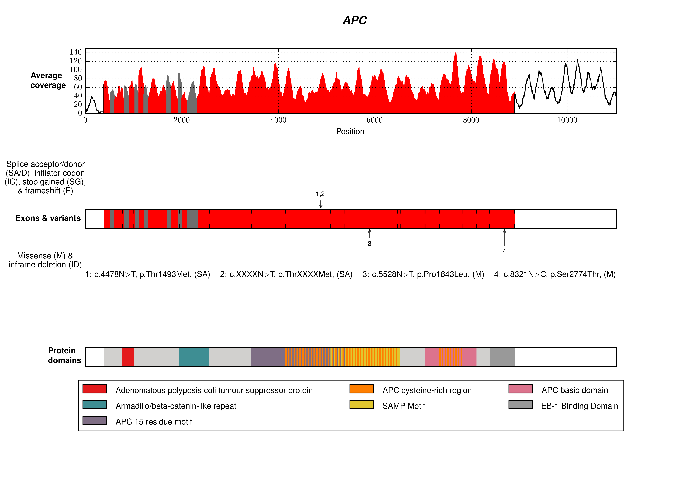

Short tutorial
##############

The repository contains an example script in :file:`src/examples` which demonstrates how to use transplot to make single and multi-track plots using example data in :file:`examples/data/input`. 
The following code in the example script makes the 3-track plot shown below, plus five additional plots which contain one or two of the same tracks.

.. code-block:: python
 
   from transplot import transplotter as ngstp
   from transplot import settings as s
   import sys
   import os

   #Make the input/output dir paths.
   input_dir = os.path.abspath(os.path.join(os.path.dirname(os.path.abspath(__file__)),"..","data","input"))
   output_dir = os.path.abspath(os.path.join(os.path.dirname(os.path.abspath(__file__)),"..","data","plots"))
   if not os.path.exists(output_dir):
       os.makedirs(output_dir)

   #Set other paths/variables.
   apc_utrs_txt = os.path.join(input_dir,"APC_utrs.txt")
   apc_utrs_reverse_txt = os.path.join(input_dir,"APC_utrs_manual_reverse.txt")
   apc_canon_trans = "ENST00000457016"
   apc_coverage_csv = os.path.join(input_dir,"APC_{0}_small.csv".format(apc_canon_trans))
   apc_coverage_reverse_csv = os.path.join(input_dir,"APC_{0}_small_reverse.csv".format(apc_canon_trans))
   apc_variants_cases_txt = os.path.join(input_dir,"APC_variants_CASES.txt")
   apc_variants_cases_reverse_txt = os.path.join(input_dir,"APC_variants_CASES_reverse.txt")
   protein_domain_txt = os.path.join(input_dir,"APC_exoplot_domains_wt_overlaps.txt")

   #Print out help message for ngs_transcript_plotter module.
   help(ngstp)

   #Make a protein domain color file.
   protein_domain_color_csv = os.path.join(input_dir,"protein_domain_color.csv")
   ngstp.make_protein_domain_color_file(
           protein_domain_file=os.path.join(input_dir, "APC_exoplot_domains_wt_overlaps.txt"),
           transcript_l= [apc_canon_trans],
           database="Pfam", 
           sortby_col_l=["Start"],
           out_path=protein_domain_color_csv)

   #Make exon coordinates files.
   exon_coord_csv,exon_coord_reverse_csv = os.path.join(input_dir , "APC_exon_coord.csv"),os.path.join(input_dir , "APC_exon_coord_reverse.csv")
   ngstp.make_exon_coord_file(apc_coverage_csv,apc_canon_trans,exon_coord_csv)
   ngstp.make_exon_coord_file(apc_coverage_reverse_csv,apc_canon_trans,exon_coord_reverse_csv)

   #Display the settings.
   setting_dict = s.get_setting_dict()
   s.display_setting_dict(setting_dict)

   #Make example plots - same data but with different combinations of the 3 tracks.
   track_ll = [["111"],["110"],["101"],["011"],["010"],["001"]]
   plot_path_l = [os.path.join(output_dir,"APC_cases_make_png_{0}.png".format(i+1)) for i in range(len(track_ll))]
   for i in range(len(track_ll)):
       ngstp.make_png([apc_canon_trans],
                      [r'\textbf{\textit{APC}}'],
                      track_ll[i],
                      [["543_A10"]],
                      [apc_utrs_txt],
                      [exon_coord_csv],
                      [apc_coverage_csv],
                      [apc_variants_cases_txt],
                      [protein_domain_txt],
                      protein_domain_color_csv,
                      setting_dict,
                      plot_path_l[i])         

API reference
#############

transplotter
============

.. automodule:: transplotter
   :members:

coverage
=========

.. automodule:: coverage
   :members:

protdomains
===========

.. automodule:: protdomains
   :members:

utrs
====

.. automodule:: utrs
   :members:
   
variants
========

.. automodule:: variants
   :members:
 
settings
========

.. automodule:: settings
   :members:
  